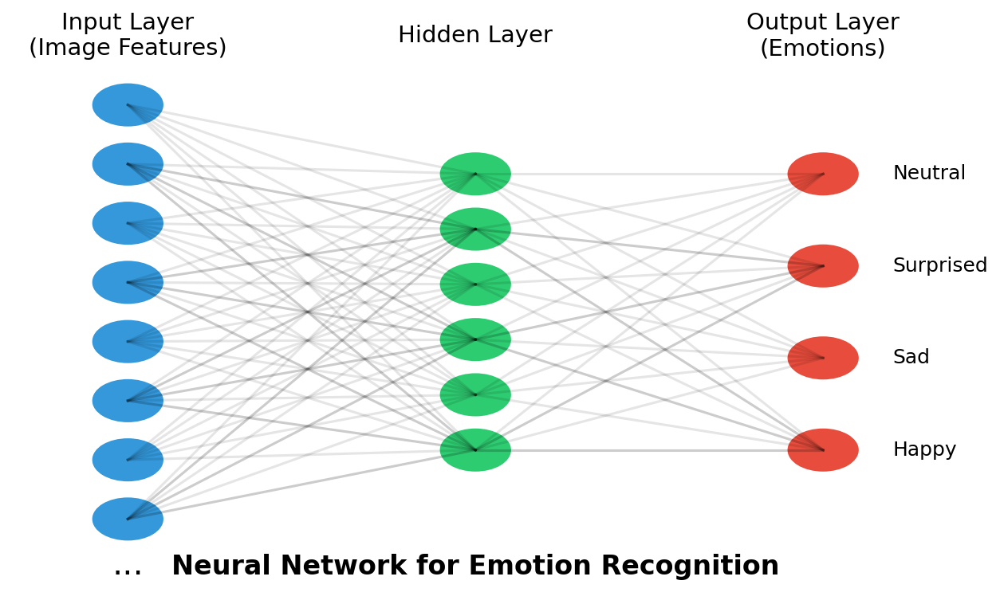

# Build Your Own Emotion Recognition AI

## Introduction

Welcome to the Emotion Recognition Activity! Today, you'll build your own AI system that can recognize facial expressions and identify emotions. This is very similar to how real AI systems are built in industry and research labs.

You'll collect data, train a neural network model, and test it in real-time — all in 30 minutes!

## What You'll Learn

- How AI learns from examples (supervised learning)
- How to collect and label data
- How neural networks "learn" patterns
- How to test and evaluate an AI model

## Activity Outline (30 minutes)

1. **Data Collection** (10 minutes)
   - Capture and label facial expressions 
   - Build your training dataset

2. **Model Training** (5 minutes)
   - Train a neural network on your dataset
   - Learn how the computer "sees" emotions

3. **Testing Your Model** (5 minutes)
   - Test your model with new expressions
   - See how well it recognizes emotions

4. **Discussion and Exploration** (10 minutes)
   - How could you improve your model?
   - What are real-world applications?
   - What are ethical considerations?

## Step-by-Step Instructions

### Step 1: Collect Training Data

1. When the application starts, click the **"Start Webcam"** button
2. Select an emotion from the dropdown menu (Happy, Sad, Surprised, or Neutral)
3. Make the corresponding facial expression
4. Click **"Capture Image"** to take a picture
5. Repeat 10-15 times for *each* emotion
   - Try different angles and expressions
   - The more varied your dataset, the better!

### Step 2: Train Your Model

1. After collecting at least 5 images for each emotion, click **"Train Model"**
2. Watch the progress bar and wait for training to complete (it takes about 1-2 minutes)
3. While waiting, read the "How AI Works" section below

### Step 3: Test Your Model

1. Make a facial expression (try different ones!)
2. Click **"Predict Emotion"**
3. See the prediction result
4. Try again with different expressions
5. Challenge: Try to "trick" your model!

## How AI Works: Behind the Scenes

### 1. Data Collection and Preparation

When you capture images:
- Your webcam takes a photo
- The image is automatically resized to 224×224 pixels
- The image is labeled with the emotion you selected
- The labeled image is saved to your training dataset

### 2. Neural Network Training

When you click "Train Model":
- Your images are processed and converted to numbers
- Each pixel becomes a value between 0-255 (brightness)
- The neural network learns patterns that correspond to each emotion
- It adjusts its "weights" (parameters) to improve predictions

### 3. Transfer Learning

We're using a technique called "transfer learning" with a pre-trained model called MobileNetV2:
- This model already knows how to recognize basic features in images
- We're "fine-tuning" it to recognize emotional expressions
- This is much faster than training from scratch!

### 4. Prediction

When you click "Predict Emotion":
- Your current webcam image is captured
- It's processed the same way as the training images
- The model compares the image to the patterns it learned
- It gives you the most likely emotion based on its training

## Challenge Questions

1. How would you improve the accuracy of your model?
2. What other emotions could you add to your model?
3. How might this technology be used in the real world?
4. Are there any potential concerns about using emotion recognition technology?

## AI in the Real World

This simple demo shows the basic principles behind many real-world AI systems, including:
- Face ID on smartphones
- Social media photo tagging
- Self-driving cars
- Medical image analysis
- Security systems

## Take It Further

Interested in learning more? Check out these resources:
- [Teachable Machine](https://teachablemachine.withgoogle.com/) by Google
- [Elements of AI](https://www.elementsofai.com/) - Free online course
- [Fast.ai](https://www.fast.ai/) - Practical Deep Learning 